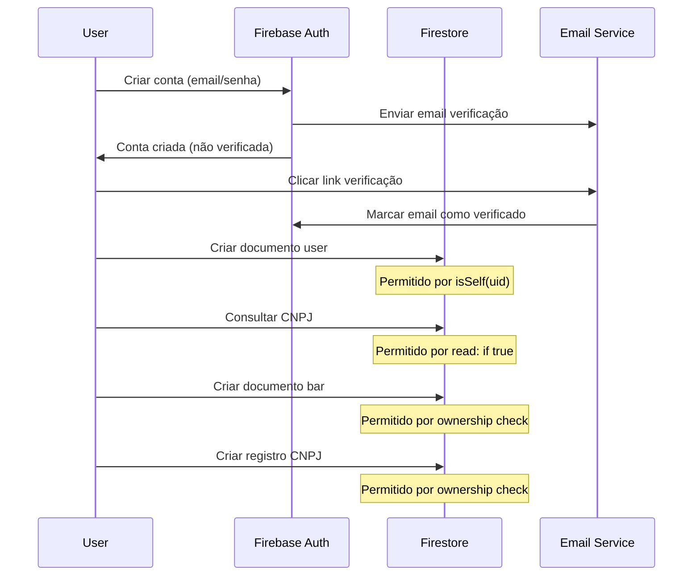
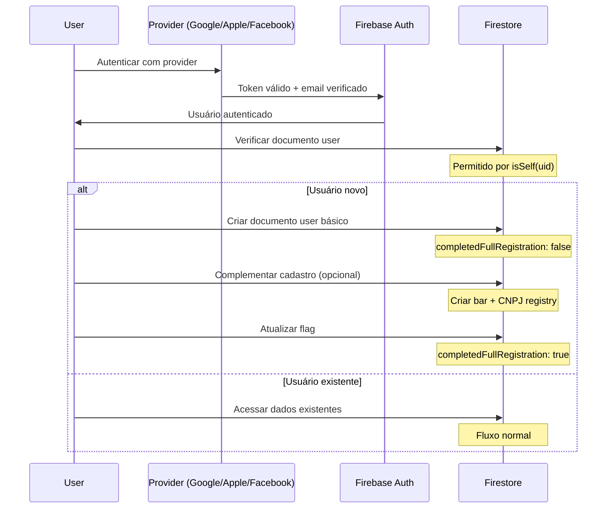

# 🔐 FIRESTORE_AUTH_FLOW.md - Fluxo de Autenticação e Cadastro

**Versão:** 1.0  
**Última Atualização:** 17 de Setembro de 2025  
**Objetivo:** Documentação consolidada do fluxo de autenticação e cadastro funcional

---

## 📋 1. VISÃO GERAL

Este documento descreve o fluxo completo de autenticação e cadastro implementado no Agenda de Boteco, baseado nas regras de segurança do Firestore atualmente em produção. O sistema suporta dois fluxos principais: **Cadastro Clássico** (email/senha) e **Login Social** (Google, Apple, Facebook).

### Princípios de Segurança Aplicados
- **Autenticação obrigatória**: Todas as operações exigem usuário autenticado
- **Ownership**: Usuários só podem acessar/modificar seus próprios dados
- **Validação no signup**: CNPJ pode ser consultado sem autenticação para validação
- **Soft delete**: Exclusão de usuários não é permitida
- **Least privilege**: Menor privilégio necessário para cada operação

---

## 🔑 2. FUNÇÕES DE SEGURANÇA IMPLEMENTADAS

### Funções Base
```javascript
function isAuthed() { 
  return request.auth != null; 
}

function isSelf(uid) { 
  return isAuthed() && request.auth.uid == uid; 
}
```

### Racional das Funções
- **`isAuthed()`**: Verifica se há um usuário autenticado válido
- **`isSelf(uid)`**: Garante que o usuário só acesse seus próprios dados
- **Simplicidade**: Funções enxutas para melhor performance e manutenibilidade

---

## 👤 3. COLEÇÃO: USERS

### Estrutura de Permissões
```javascript
match /users/{uid} {
  allow read: if isSelf(uid);
  allow create: if isSelf(uid);
  allow update: if isSelf(uid);
  allow delete: if false;
}
```

### Racional das Permissões

#### **READ (Leitura)**
- **Quem pode**: Apenas o próprio usuário (`isSelf(uid)`)
- **Por quê**: Proteção de dados pessoais e privacidade
- **Suporte aos fluxos**: Funciona tanto para cadastro clássico quanto social

#### **CREATE (Criação)**
- **Quem pode**: Usuário autenticado criando seu próprio documento
- **Por quê**: Evita criação de documentos por terceiros
- **Fluxo clássico**: Após verificação de email
- **Fluxo social**: Imediatamente após autenticação social

#### **UPDATE (Atualização)**
- **Quem pode**: Apenas o próprio usuário
- **Por quê**: Impede alteração de dados por terceiros
- **Casos de uso**: Atualização de perfil, preferências, currentBarId

#### **DELETE (Exclusão)**
- **Quem pode**: Ninguém (`if false`)
- **Por quê**: Implementação de soft delete para auditoria
- **Alternativa**: Marcar como inativo via update

### Boas Práticas Aplicadas
- **Ownership estrito**: Cada usuário controla apenas seus dados
- **Auditoria**: Histórico preservado com soft delete
- **Privacidade**: Dados pessoais protegidos por padrão

---

## 🏪 4. COLEÇÃO: BARS

### Estrutura de Permissões
```javascript
match /bars/{barId} {
  allow read: if isAuthed();
  
  allow create: if isAuthed() &&
    (request.resource.data.primaryOwnerUid == request.auth.uid ||
     request.resource.data.ownerUid == request.auth.uid);
  
  allow update, delete: if isAuthed() &&
    (resource.data.primaryOwnerUid == request.auth.uid ||
     resource.data.ownerUid == request.auth.uid);
}
```

### Racional das Permissões

#### **READ (Leitura)**
- **Quem pode**: Qualquer usuário autenticado
- **Por quê**: Permite descoberta de bares e funcionalidades sociais
- **Casos de uso**: Busca de bares, visualização de eventos públicos

#### **CREATE (Criação)**
- **Quem pode**: Usuário autenticado que se define como owner no payload
- **Por quê**: Garante que apenas o criador seja o dono inicial
- **Validação**: Verifica `primaryOwnerUid` ou `ownerUid` no documento
- **Suporte aos fluxos**: Funciona para ambos os tipos de cadastro

#### **UPDATE/DELETE (Modificação/Exclusão)**
- **Quem pode**: Apenas o owner do bar existente
- **Por quê**: Proteção contra modificações não autorizadas
- **Flexibilidade**: Suporta tanto `primaryOwnerUid` quanto `ownerUid`

### Boas Práticas Aplicadas
- **Ownership validation**: Verificação no momento da criação
- **Backward compatibility**: Suporte a ambos os campos de owner
- **Social discovery**: Leitura liberada para funcionalidades sociais

---

## 👥 5. SUBCOLEÇÕES: MEMBERS E MEMBERSHIPS

### Members (Compatibilidade)
```javascript
match /members/{memberId} {
  allow read: if isAuthed() && resource.data.uid == request.auth.uid;
  allow create: if isAuthed() && request.resource.data.uid == request.auth.uid;
  allow update, delete: if false;
}
```

### Memberships (Padrão Novo)
```javascript
match /memberships/{memberId} {
  allow read: if isAuthed() && resource.data.uid == request.auth.uid;
  allow create: if isAuthed() && request.resource.data.uid == request.auth.uid;
  allow update, delete: if false;
}
```

### Racional das Permissões

#### **READ (Leitura)**
- **Quem pode**: Usuário autenticado lendo seu próprio vínculo
- **Por quê**: Privacidade dos relacionamentos usuário-bar
- **Implementação**: Verifica `resource.data.uid == request.auth.uid`

#### **CREATE (Criação)**
- **Quem pode**: Usuário criando seu próprio vínculo
- **Por quê**: Auto-gestão de memberships
- **Validação**: Garante que `uid` no documento seja do usuário logado

#### **UPDATE/DELETE (Modificação/Exclusão)**
- **Quem pode**: Ninguém (`if false`)
- **Por quê**: Gestão via Cloud Functions ou admin
- **Benefício**: Controle centralizado de permissões e roles

### Boas Práticas Aplicadas
- **Self-management**: Usuários gerenciam seus próprios vínculos
- **Centralized control**: Modificações via backend para consistência
- **Privacy**: Relacionamentos privados por padrão

---

## 🎉 6. SUBCOLEÇÃO: EVENTS

### Estrutura de Permissões
```javascript
match /events/{eventId} {
  allow read: if isAuthed();
  allow create: if isAuthed() && request.resource.data.createdByUid == request.auth.uid;
  allow update, delete: if isAuthed() && resource.data.createdByUid == request.auth.uid;
}
```

### Racional das Permissões

#### **READ (Leitura)**
- **Quem pode**: Qualquer usuário autenticado
- **Por quê**: Eventos são públicos para descoberta
- **Casos de uso**: Listagem de eventos, agenda pública

#### **CREATE (Criação)**
- **Quem pode**: Usuário autenticado que se define como criador
- **Por quê**: Ownership desde a criação
- **Validação**: `createdByUid` deve ser do usuário logado

#### **UPDATE/DELETE (Modificação/Exclusão)**
- **Quem pode**: Apenas o criador do evento
- **Por quê**: Controle editorial do conteúdo
- **Flexibilidade**: Permite edição e cancelamento

### Boas Práticas Aplicadas
- **Public discovery**: Eventos visíveis para todos
- **Creator control**: Apenas criador pode modificar
- **Content ownership**: Responsabilidade clara sobre o conteúdo

---

## 📋 7. COLEÇÃO: CNPJ_REGISTRY

### Estrutura de Permissões
```javascript
match /cnpj_registry/{cnpj} {
  allow read: if true;  // DEV: leitura liberada para validação no signup
  
  allow create: if isAuthed() &&
    (request.resource.data.primaryOwnerUid == request.auth.uid ||
     request.resource.data.ownerUid == request.auth.uid);
     
  allow update: if isAuthed() &&
    (resource.data.primaryOwnerUid == request.auth.uid ||
     resource.data.ownerUid == request.auth.uid);
     
  allow delete: if false;
}
```

### Racional das Permissões

#### **READ (Leitura)**
- **Quem pode**: Qualquer um (`if true`)
- **Por quê**: Validação de CNPJ durante signup sem autenticação
- **Status**: Temporário para desenvolvimento
- **Futuro**: Migrar para Cloud Function ou auth anônima

#### **CREATE/UPDATE (Criação/Modificação)**
- **Quem pode**: Owner do registro
- **Por quê**: Controle sobre dados empresariais
- **Validação**: Verifica ownership no documento

#### **DELETE (Exclusão)**
- **Quem pode**: Ninguém (`if false`)
- **Por quê**: Auditoria e histórico de CNPJs

### Boas Práticas Aplicadas
- **Validation support**: Permite validação durante cadastro
- **Ownership control**: Apenas owner pode modificar
- **Audit trail**: Histórico preservado

### Considerações de Segurança
- **⚠️ Atenção**: Leitura liberada é temporária
- **Recomendação**: Implementar Cloud Function para validação
- **Alternativa**: Usar autenticação anônima

---

## 🔍 8. COLLECTION GROUP QUERIES

### Estrutura de Permissões
```javascript
match /{path=**}/members/{memberId} {
  allow read: if isAuthed() && resource.data.uid == request.auth.uid;
}

match /{path=**}/memberships/{memberId} {
  allow read: if isAuthed() && resource.data.uid == request.auth.uid;
}
```

### Racional das Permissões

#### **Collection Group Queries**
- **Funcionalidade**: Consultas across múltiplos bares
- **Segurança**: Filtro por `uid == request.auth.uid`
- **Casos de uso**: "Meus bares", "Meus vínculos"

### Boas Práticas Aplicadas
- **Cross-collection queries**: Eficiência em consultas complexas
- **Privacy maintained**: Apenas dados próprios retornados
- **Performance**: Queries otimizadas com filtros

---

## 🚀 9. FLUXOS DE AUTENTICAÇÃO SUPORTADOS

### 9.1 Fluxo Clássico (Email/Senha)

#### Passo 1: Cadastro Inicial
1. **Validação de dados**: Email, CNPJ, nome do bar, etc.
2. **Verificação CNPJ**: Consulta `cnpj_registry` (sem auth)
3. **Criação de conta**: Firebase Auth com email/senha
4. **Status**: Usuário criado, mas não verificado

#### Passo 2: Verificação de Email
1. **Email enviado**: Automaticamente pelo Firebase
2. **Aguardo**: Usuário verifica email
3. **Verificação**: `email_verified = true`

#### Passo 3: Criação de Dados
1. **Documento user**: Criado em `/users/{uid}` (permitido por `isSelf`)
2. **Documento bar**: Criado em `/bars/{barId}` (permitido por ownership)
3. **Registro CNPJ**: Criado em `/cnpj_registry/{cnpj}`
4. **Status**: Cadastro completo

### 9.2 Fluxo Social (Google/Apple/Facebook)

#### Passo 1: Autenticação Social
1. **Provider auth**: Google, Apple ou Facebook
2. **Token válido**: Imediatamente disponível
3. **Email verificado**: Automaticamente `true`

#### Passo 2: Verificação de Dados
1. **Usuário existente**: Redireciona para Home
2. **Usuário novo**: Verifica `completedFullRegistration`
3. **Cadastro incompleto**: Exibe banner na Home

#### Passo 3: Complemento de Cadastro (se necessário)
1. **Passo 1/2/3**: Coleta dados do bar
2. **Criação**: Documentos `bar` e `cnpj_registry`
3. **Flag**: `completedFullRegistration = true`

### 9.3 Comparação dos Fluxos

| Aspecto | Clássico | Social |
|---------|----------|--------|
| **Verificação email** | Manual | Automática |
| **Tempo para acesso** | Após verificação | Imediato |
| **Dados obrigatórios** | Todos no cadastro | Complemento posterior |
| **UX** | Linear | Flexível |
| **Segurança** | Email verificado | Provider confiável |

---

## 🛡️ 10. CONSIDERAÇÕES DE SEGURANÇA

### 10.1 Princípios Aplicados

#### **Defense in Depth**
- **Client-side**: Validação de UX
- **Firestore Rules**: Validação de acesso
- **Cloud Functions**: Lógica de negócio complexa

#### **Least Privilege**
- **Users**: Apenas próprios dados
- **Bars**: Owner control
- **Events**: Creator control

#### **Data Validation**
- **Type checking**: Implícito nas regras
- **Ownership**: Explícito em todas as operações
- **Business logic**: Delegada para Cloud Functions

### 10.2 Pontos de Atenção

#### **CNPJ Registry**
- **⚠️ Risco**: Leitura liberada temporariamente
- **Mitigação**: Implementar Cloud Function
- **Timeline**: Próxima iteração

#### **Soft Delete**
- **✅ Implementado**: Users e CNPJ Registry
- **Benefício**: Auditoria e recuperação
- **Consideração**: Limpeza periódica necessária

#### **Collection Group Queries**
- **✅ Seguro**: Filtro por UID obrigatório
- **Performance**: Índices necessários
- **Monitoramento**: Uso de queries complexas

---

## 📊 11. BOAS PRÁTICAS IMPLEMENTADAS

### 11.1 Segurança

#### **Autenticação Obrigatória**
- ✅ Todas as operações exigem `isAuthed()`
- ✅ Exceção controlada: CNPJ validation
- ✅ Fallback: Bloqueio padrão (`if false`)

#### **Ownership Validation**
- ✅ Users: `isSelf(uid)`
- ✅ Bars: `primaryOwnerUid` ou `ownerUid`
- ✅ Events: `createdByUid`
- ✅ Members/Memberships: `resource.data.uid`

#### **Data Integrity**
- ✅ Soft delete para auditoria
- ✅ Ownership desde criação
- ✅ Backward compatibility

### 11.2 Performance

#### **Regras Simples**
- ✅ Funções enxutas
- ✅ Lógica direta
- ✅ Cache-friendly

#### **Queries Otimizadas**
- ✅ Collection group support
- ✅ Filtros por UID
- ✅ Índices implícitos

### 11.3 UX/UI

#### **Signup sem Auth**
- ✅ Validação CNPJ liberada
- ✅ UX fluida no cadastro
- ✅ Segurança mantida

#### **Flexibilidade de Fluxos**
- ✅ Clássico e Social suportados
- ✅ Cadastro incremental
- ✅ Estados intermediários

---

## 🔄 12. FLUXO DE DADOS DETALHADO

### 12.1 Cadastro Clássico - Sequência Completa



### 12.2 Login Social - Sequência Completa



---

## 📚 13. DOCUMENTAÇÃO RELACIONADA

Para implementação completa, consulte:

- **[BUSINESS_RULES_AUTH.md](./BUSINESS_RULES_AUTH.md)**: Regras de negócio de autenticação
- **[FIRESTORE_SCHEMA.md](./FIRESTORE_SCHEMA.md)**: Estrutura detalhada dos dados
- **[PROJECT_RULES.md](./PROJECT_RULES.md)**: Regras globais do projeto
- **[CADASTRO_RULES.md](./CADASTRO_RULES.md)**: Regras específicas de cadastro
- **[STORAGE_ARCHITECTURE.md](./STORAGE_ARCHITECTURE.md)**: Arquitetura de armazenamento
- **[USER_RULES.md](./USER_RULES.md)**: Diretrizes de interação

---

## 🔧 14. PRÓXIMOS PASSOS

### 14.1 Melhorias de Segurança
- [ ] Migrar validação CNPJ para Cloud Function
- [ ] Implementar rate limiting
- [ ] Adicionar logs de auditoria

### 14.2 Performance
- [ ] Otimizar índices do Firestore
- [ ] Implementar cache local (Drift)
- [ ] Monitorar queries complexas

### 14.3 Funcionalidades
- [ ] Sistema de roles avançado
- [ ] Convites para membros
- [ ] Gestão de permissões granular

---

**🔒 Este documento reflete o estado atual das regras de segurança em produção. Mantenha-o atualizado após mudanças nas regras do Firestore.**